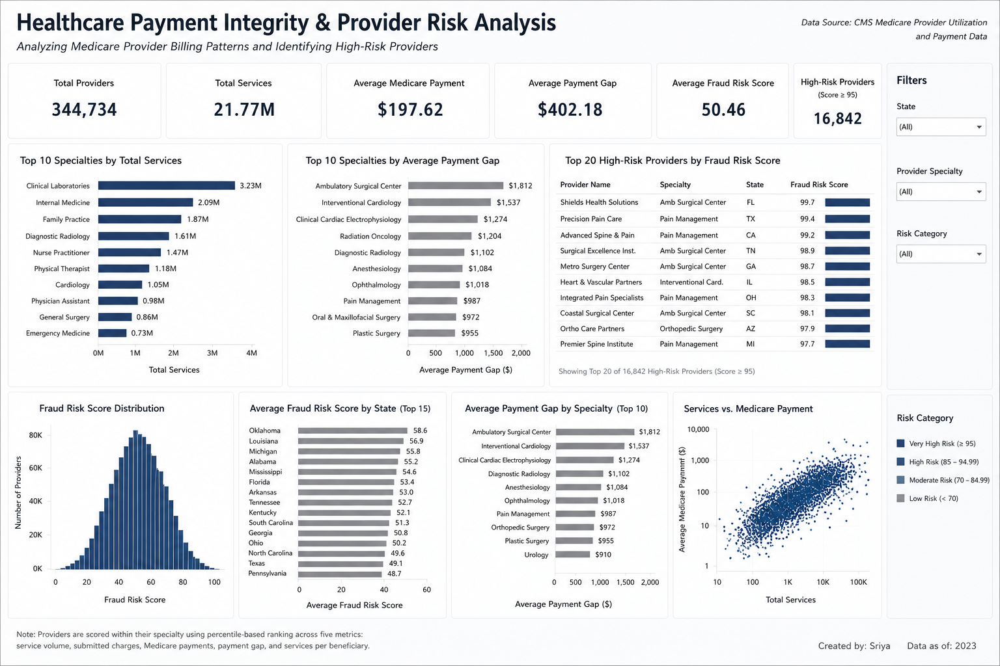

# 🏥 Healthcare Payment Integrity & Provider Risk Analysis


## 📖 Project Overview

Healthcare organizations process millions of Medicare claims every year, making it difficult to manually identify providers with unusual billing behavior.

This project analyzes the **CMS Medicare Physician & Other Practitioners (2024)** dataset using **Python, MySQL, and Tableau** to identify unusual provider billing patterns and support **payment integrity analysis**.

A **Provider Risk Score** was developed by benchmarking providers within their own specialties across multiple billing metrics, helping prioritize providers for further review.

---

## 🎯 Business Problem

Healthcare payment integrity teams must identify providers whose billing patterns differ significantly from their peers.

Since manually reviewing every Medicare claim is impractical, analytics can be used to identify providers with unusual billing behavior and prioritize them for further investigation.

---

## 📂 Dataset

**Source:** https://data.cms.gov/provider-summary-by-type-of-service/medicare-physician-other-practitioners/medicare-physician-other-practitioners-by-provider-and-service/data


**Dataset:** Medicare Physician & Other Practitioners by Provider and Service (2024)

| Metric | Value |
|---------|------:|
| Original Dataset | 9.7+ Million Records |
| Original File Size | ~3 GB |
| Sample Used for Analysis | 489,084 Records |
| Final Provider Dataset | 344,734 Providers |

---

## 🛠️ Tools & Technologies

- Python, Pandas, NumPy , Matplotlib , MySQL, Tableau, GitHub

## 🔄 Project Workflow

```text
CMS Medicare Dataset
        │
        ▼
Python
• Data Cleaning
• Missing Value Handling
• Random Sampling

        │
        ▼
MySQL
• Business Analysis
• Provider Aggregation
• Payment Gap Analysis
• Provider Risk Score Calculation

        │
        ▼
Python
• Correlation Analysis
• IQR Outlier Detection
• Statistical Analysis

        │
        ▼
Tableau
• Interactive Dashboard
• Business Insights
```

---

## 📊 Payment Integrity Approach

Providers were benchmarked **within their own specialties** using percentile-based analysis across the following billing metrics:

- Total Services
- Average Submitted Charges
- Average Medicare Payment
- Average Payment Gap
- Services per Beneficiary

These metrics were combined into a **weighted Provider Risk Score** to prioritize providers with unusual billing behavior.

> **Note:** The Provider Risk Score identifies unusual billing patterns and supports payment integrity review. It does **not** indicate confirmed fraud.

---

# 📈 Tableau Dashboard

<p align="center">
  
</p>


# 📌 Key Findings

- Clinical Laboratories recorded the highest Medicare service volume among all provider specialties.
- Ambulatory Surgical Centers exhibited some of the highest average payment gaps.
- Submitted Charges and Payment Gap showed a **very strong positive correlation (0.99)**.
- Total Services and Services per Beneficiary demonstrated a **strong positive correlation (0.84)**.
- Approximately **10.5%** of providers were identified as submitted-charge outliers using the IQR method.
- Provider Risk Scores were calculated using percentile-based benchmarking within specialties, ensuring fair comparisons across provider types.
- The weighted Provider Risk Score combines multiple billing indicators into a single metric, enabling more balanced payment integrity analysis.
- The analysis helps prioritize providers for further review based on unusual billing behavior rather than identifying confirmed fraud.

---

---


---

# 👩‍💻 Author

**Created by Sriya**

If you found this project interesting, feel free to explore my GitHub repositories and connect with me on 
LinkedIn : https://www.linkedin.com/in/sriya-byreddy/

---

